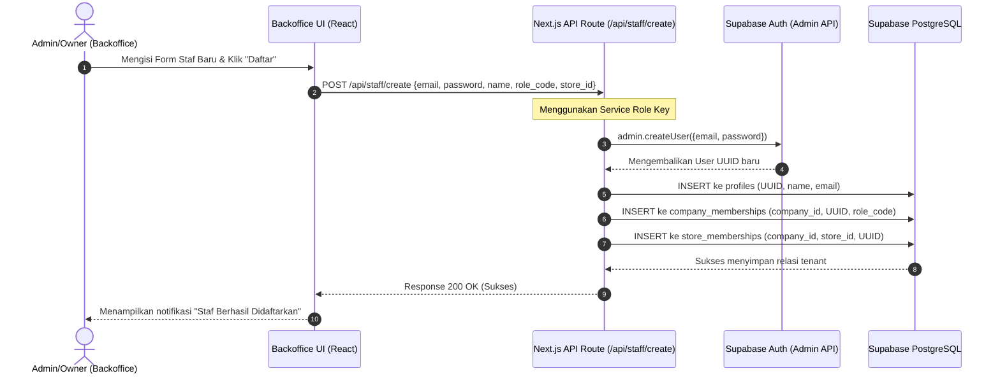

# Alur Kerja Autentikasi & Pembuatan Staf KGS Mini-ERP (Multi-Tenant SaaS)

Dokumen ini menjelaskan alur kerja (*workflow*) autentikasi, pembatasan hak akses, dan tata cara penambahan pengguna baru di dalam platform KGS Mini-ERP. Dokumentasi ini berfungsi sebagai acuan pengembang (*developer reference*) agar pemisahan data (*multi-tenant isolation*) tetap terjaga tanpa membingungkan pengguna akhir (*tenant*).

---

## 1. Arsitektur Multi-Tenant & Kunci Keamanan

KGS Mini-ERP dirancang sebagai sistem **SaaS Multi-Company** di mana satu database fisik menampung banyak perusahaan (*companies*). Data antarperusahaan disekat ketat menggunakan **Row Level Security (RLS)** di Supabase.

### 🔑 Pembagian Tanggung Jawab Kunci API (Supabase Keys)

| Kunci API | Lokasi Konfigurasi | Siapa yang Mengakses? | Peran Keamanan |
| :--- | :--- | :--- | :--- |
| **`NEXT_PUBLIC_SUPABASE_PUBLISHABLE_KEY`** (Anon Key) | `.env.local` (Client & Server) | Browser Pengguna / Frontend | Kunci publik untuk operasi standar yang terikat RLS. User hanya bisa membaca/menulis baris data miliknya sendiri. |
| **`SUPABASE_SERVICE_ROLE_KEY`** (Secret Admin Key) | `.env.local` (Hanya di Server-Side API) | Server Backend Next.js (`/api/staff/create`) | **Bypass RLS**. Hanya digunakan oleh server secara internal untuk mendaftarkan akun staf baru di auth Supabase tanpa memaksa admin keluar dari sesinya. |

> [!IMPORTANT]
> **Tenant/Klien ERP tidak pernah menyentuh dashboard Supabase.** 
> Konfigurasi `SUPABASE_SERVICE_ROLE_KEY` dilakukan **sekali saja** oleh sistem administrator/developer saat melakukan *deployment* (misal di Vercel/VPS env). Setelah itu, seluruh operasional penambahan staf dilakukan oleh pemilik perusahaan langsung melalui tombol di UI Backoffice.

---

## 2. Alur Kerja Pembuatan User (Tanpa Akses Dashboard Supabase)

Untuk mencegah kebocoran data (*data leaks*) dan menjaga keamanan, pendaftaran publik (*public sign-up*) dinonaktifkan. Seluruh kendali pembuatan user berada di tangan **Pemilik Perusahaan (Company Owner)**.



### Penjelasan Detil Langkah-Langkah:
1. **Langkah 1**: Pemilik perusahaan yang sah masuk ke Backoffice dan membuka tab **Kelola Staf**, lalu mengisi data staf baru (Email, Nama, Password Sementara, Peran, Toko).
2. **Langkah 2**: Frontend mengirimkan payload data tersebut ke backend Next.js API route `/api/staff/create`.
3. **Langkah 3-4**: Backend API (berjalan di server yang aman) menggunakan `SUPABASE_SERVICE_ROLE_KEY` untuk memanggil fungsi admin auth `createUser()`. Supabase mendaftarkan kredensial tersebut secara aman ke dalam skema internal `auth.users` dan mengonfirmasi emailnya secara otomatis (`email_confirm: true`).
4. **Langkah 5-7**: Backend menyisipkan data detail relasi tenant ke tabel `profiles`, `company_memberships`, dan `store_memberships` di bawah ID Perusahaan pemilik yang sedang memproses.
5. **Langkah 8**: Pengguna baru (Kasir/Admin Toko) kini dapat langsung masuk ke aplikasi PWA Kasir menggunakan kredensial yang dibuatkan tadi.

---

## 3. Tingkatan Peran & Otorisasi (*Authorization Levels*)

Setiap akun pengguna diikat ke satu perusahaan melalui tabel `company_memberships` dengan salah satu peran berikut:

| Peran (Role Code) | Hak Akses Utama | Aplikasi yang Digunakan |
| :--- | :--- | :--- |
| **`COMPANY_OWNER`** | Hak akses penuh: Keuangan, Jurnal, Stok, Pembelian (PO), dan Manajemen Staf (Membuat/Menghapus User Staf). | Backoffice |
| **`COMPANY_ADMIN`** | Mengelola Katalog Produk, Lokasi Gudang, PO, dan melihat Jurnal Umum. | Backoffice |
| **`FINANCE` / `ACCOUNTING`** | Melihat Event Finansial, entri Jurnal Umum, Laporan Keuangan Laba/Rugi, dan Audit FIFO. | Backoffice |
| **`STORE_MANAGER`** | Mengelola stok lokal toko, menyetujui *Stock Opname* lokal, dan melihat riwayat POS toko. | Backoffice & PWA Kasir |
| **`CASHIER`** | Melakukan checkout penjualan (*POS sales checkout*) dan membuka/menutup sesi kasir (*cashier sessions*). | PWA Kasir (POS) |

---

## 4. Panduan Pengembangan Lokal & Pengujian RLS

Untuk menguji fitur ini di komputer lokal developer:

1. **Jalankan File Seed**: 
   Eksekusi **`supabase/seed_company_data.sql`** di SQL Editor Supabase Anda sekali untuk mengisi data perusahaan mula-mula dan membuat satu akun owner pengujian (`kasir1@kgs.com` / `password123`).
2. **Konfigurasi `.env.local`**:
   Masukkan publishable key dan service role key di berkas `backoffice/.env.local`:
   ```env
   NEXT_PUBLIC_SUPABASE_URL=https://<your-project-id>.supabase.co
   NEXT_PUBLIC_SUPABASE_PUBLISHABLE_KEY=<your-anon-key>
   SUPABASE_SERVICE_ROLE_KEY=<your-service-role-key>
   ```
3. **Uji Coba**:
   * Login ke Backoffice dengan `kasir1@kgs.com`.
   * Coba buat user baru melalui menu **Kelola Staf**.
   * Keluar (Logout) dan coba masuk menggunakan akun staf baru yang baru saja Anda buat. Anda akan melihat bahwa data yang ditampilkan tersaring otomatis sesuai tenant (`company_id`) tempat akun tersebut didaftarkan.
