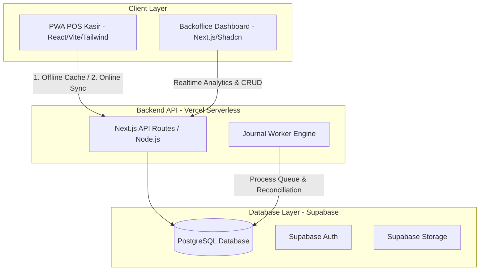

# KGS Mini-ERP Migration Blueprint
## Google Sheets to Supabase, Vercel, and Offline-First PWA

This document serves as the master architectural specification and migration roadmap for the KGS Mini-ERP system. It defines the database schema, frontend/backend architecture, offline-first mechanisms, and event-based double-entry accounting automation. Use this document as a system prompt reference for AI development agents.

---

## 1. Executive Summary & Goals

The legacy Google Sheets + Apps Script architecture has hit its scaling limits:
* **Latency Bottleneck**: Save transactions take 30 to 45 seconds due to Google Sheets API read/write delays and sequential calculations.
* **Concurrency Locking**: Multiple cashiers checking out simultaneously cause lock-wait timeouts and duplicate/failed journal entries.
* **Offline Vulnerability**: Poor network connectivity completely halts cashier operations.
* **Failures in Automated Journaling**: Complex background triggers frequently fail due to execution time limits (6-minute timeout) and race conditions.

### Migration Target Goals:
* **Sub-Second Latency**: Checkout and stock updates completed in `< 300ms` via Supabase (Postgres) and Vercel.
* **100% Transaction Safety**: Concurrent checkout requests managed using Postgres ACID transactions, triggers, and locking.
* **Offline-First Cashier POS**: POS cashier UI running as a Progressive Web App (PWA) with a local cache database (Dexie/IndexedDB) allowing 100% offline checkout with automatic background synchronization when online.
* **Robust Journaling (Event-Based)**: POS commits write to an immutable `financial_events` table, which is processed asynchronously by a robust Node.js worker on Vercel, posting double-entry rows to `journal_entries` with automatic reconciliation checks.

---

## 2. System Architecture Overview

---

## 3. Database Schema (Supabase / PostgreSQL)

Below is the structured relational schema for Supabase.

### 3.1. General & Authentication
* **`profiles`**
  * `id` (UUID, Primary Key, references `auth.users`)
  * `email` (TEXT, unique)
  * `name` (TEXT)
  * `role` (ENUM: `'cashier'`, `'manager'`, `'owner'`)
  * `created_at` (TIMESTAMPTZ, default: now)

* **`warehouses`**
  * `id` (UUID, Primary Key)
  * `code` (TEXT, unique) — e.g. `'KGS'`, `'GDS'`
  * `name` (TEXT)
  * `is_active` (BOOLEAN, default: true)
  * `created_at` (TIMESTAMPTZ, default: now)

### 3.2. Master Data
* **`products`**
  * `id` (UUID, Primary Key)
  * `sku` (TEXT, unique) — e.g. `'PROD-001'`
  * `name` (TEXT)
  * `category` (TEXT)
  * `vendor` (TEXT)
  * `merk` (TEXT)
  * `price` (NUMERIC) — Selling price
  * `cogs` (NUMERIC) — Purchase COGS/HPP Unit
  * `uom` (TEXT) — e.g. `'pcs'`, `'kg'`
  * `is_bundle` (BOOLEAN, default: false)
  * `is_active` (BOOLEAN, default: true)
  * `created_at` (TIMESTAMPTZ)

* **`product_bundle_items`** (If bundle is true)
  * `id` (UUID, Primary Key)
  * `bundle_id` (UUID, references `products.id` ON DELETE CASCADE)
  * `item_id` (UUID, references `products.id`)
  * `qty` (NUMERIC)

* **`product_stocks`** (Multi-warehouse stock levels)
  * `id` (UUID, Primary Key)
  * `product_id` (UUID, references `products.id` ON DELETE CASCADE)
  * `warehouse_id` (UUID, references `warehouses.id`)
  * `stock_qty` (NUMERIC, default: 0)
  * `updated_at` (TIMESTAMPTZ, default: now)
  * *Constraint*: UNIQUE (`product_id`, `warehouse_id`)

* **`customers`**
  * `id` (UUID, Primary Key)
  * `code` (TEXT, unique) — e.g. `'KGS001'`
  * `name` (TEXT)
  * `phone` (TEXT)
  * `address` (TEXT)
  * `current_balance` (NUMERIC, default: 0) — Customer deposit/credit balance
  * `credit_limit` (NUMERIC, default: 0) — Maximum tempo credit limit
  * `created_at` (TIMESTAMPTZ)

### 3.3. POS & Sales Operations
* **`cashier_sessions`** (`KASIR_SESI` equivalent)
  * `id` (UUID, Primary Key)
  * `session_code` (TEXT, unique) — e.g. `'SES-20260713-082533'`
  * `cashier_id` (UUID, references `profiles.id`)
  * `opened_at` (TIMESTAMPTZ, default: now)
  * `closed_at` (TIMESTAMPTZ)
  * `opening_balance` (NUMERIC, default: 0)
  * `expected_cash` (NUMERIC, default: 0)
  * `actual_cash` (NUMERIC, default: 0)
  * `difference` (NUMERIC, default: 0)
  * `note_open` (TEXT)
  * `note_close` (TEXT)
  * `status` (ENUM: `'OPEN'`, `'CLOSED'`)

* **`sales_headers`**
  * `id` (UUID, Primary Key)
  * `invoice_no` (TEXT, unique) — e.g. `'SO-00750'`
  * `session_id` (UUID, references `cashier_sessions.id`)
  * `customer_id` (UUID, references `customers.id`)
  * `transaction_date` (TIMESTAMPTZ, default: now)
  * `is_tempo` (BOOLEAN, default: false)
  * `due_date` (TIMESTAMPTZ)
  * `sj_required` (BOOLEAN, default: false)
  * `sj_no` (TEXT)
  * `sj_status` (ENUM: `'NONE'`, `'PENDING'`, `'SHIPPED'`)
  * `so_confirm_status` (ENUM: `'DRAFT'`, `'CONFIRMED'`)
  * `invoice_status` (ENUM: `'DRAFT'`, `'READY'`, `'NOT_READY'`, `'GENERATED'`)
  * `subtotal` (NUMERIC)
  * `item_discount` (NUMERIC, default: 0)
  * `global_discount` (NUMERIC, default: 0)
  * `grand_total` (NUMERIC)
  * `paid_amount` (NUMERIC, default: 0)
  * `sisa_piutang` (NUMERIC, default: 0)
  * `payment_status` (ENUM: `'DRAFT'`, `'UNPAID'`, `'PARTIAL'`, `'PAID'`)
  * `financial_status` (ENUM: `'PENDING'`, `'POSTED'`, `'PARTIALLY_POSTED'`, `'ERROR'`)
  * `recon_status` (ENUM: `'UNRECONCILED'`, `'MATCH'`, `'UNMATCH'`)
  * `created_by` (UUID, references `profiles.id`)
  * `is_revision` (BOOLEAN, default: false)
  * `original_invoice_no` (TEXT)
  * `payload_snapshot` (JSONB) — Full snapshot of raw POS payload

* **`sales_details`**
  * `id` (UUID, Primary Key)
  * `sales_id` (UUID, references `sales_headers.id` ON DELETE CASCADE)
  * `product_id` (UUID, references `products.id`)
  * `warehouse_id` (UUID, references `warehouses.id`)
  * `qty` (NUMERIC)
  * `price` (NUMERIC)
  * `discount_amount` (NUMERIC, default: 0)
  * `subtotal` (NUMERIC)
  * `cogs_unit` (NUMERIC) — Locked COGS at transaction time
  * `cogs_total` (NUMERIC)

* **`sales_payments`** (`SALES_PAYMENT_LOG` equivalent)
  * `id` (UUID, Primary Key)
  * `payment_no` (TEXT, unique) — e.g. `'PAY-20260713-001'`
  * `sales_id` (UUID, references `sales_headers.id` ON DELETE CASCADE)
  * `payment_date` (TIMESTAMPTZ, default: now)
  * `session_id` (UUID, references `cashier_sessions.id`)
  * `payment_method` (ENUM: `'Cash'`, `'Transfer'`, `'QRIS'`, `'Customer_Balance'`)
  * `amount` (NUMERIC)
  * `balance_before` (NUMERIC)
  * `balance_after` (NUMERIC)
  * `is_reversal` (BOOLEAN, default: false)
  * `reversal_ref_id` (UUID) — references self

### 3.4. Purchasing, Cash Advance & Bank Deposits
* **`purchases_headers`** (Pembelian)
  * `id` (UUID, Primary Key)
  * `purchase_no` (TEXT, unique) — e.g. `'PO-00123'`
  * `supplier_name` (TEXT)
  * `transaction_date` (TIMESTAMPTZ, default: now)
  * `warehouse_id` (UUID, references `warehouses.id`)
  * `subtotal` (NUMERIC)
  * `grand_total` (NUMERIC)
  * `paid_amount` (NUMERIC, default: 0)
  * `payment_status` (ENUM: `'UNPAID'`, `'PARTIAL'`, `'PAID'`)
  * `created_by` (UUID, references `profiles.id`)

* **`purchases_details`**
  * `id` (UUID, Primary Key)
  * `purchase_id` (UUID, references `purchases_headers.id` ON DELETE CASCADE)
  * `product_id` (UUID, references `products.id`)
  * `qty` (NUMERIC)
  * `purchase_price` (NUMERIC)
  * `subtotal` (NUMERIC)

* **`cash_advances`** (Beban Expenses)
  * `id` (UUID, Primary Key)
  * `ca_no` (TEXT, unique) — e.g. `'CA-20260713-001'`
  * `session_id` (UUID, references `cashier_sessions.id`)
  * `transaction_date` (TIMESTAMPTZ, default: now)
  * `category` (TEXT) — e.g. `'Bensin'`, `'Uang Makan'`
  * `description` (TEXT)
  * `amount` (NUMERIC)
  * `payment_method` (ENUM: `'Cash'`, `'Transfer'`)
  * `created_by` (UUID, references `profiles.id`)
  * `status` (ENUM: `'APPROVED'`, `'REJECTED'`)

* **`bank_deposits`** (Setor Tunai)
  * `id` (UUID, Primary Key)
  * `deposit_no` (TEXT, unique) — e.g. `'DEP-20260713-001'`
  * `session_id` (UUID, references `cashier_sessions.id`)
  * `transaction_date` (TIMESTAMPTZ, default: now)
  * `amount` (NUMERIC)
  * `bank_account_info` (TEXT) — e.g. `'BCA KGS 7890123'`
  * `created_by` (UUID, references `profiles.id`)

---

## 4. Ledger & Accounting Schema (Event-Based)

Double-entry accounting relies on the immutable **Event Ledger** model. POS checkouts write to the events table, and the worker processes them into debits/credits.

* **`financial_events`**
  * `id` (UUID, Primary Key)
  * `event_code` (TEXT, unique) — e.g. `'EVT-20260713-000001'`
  * `event_type` (ENUM: `'SALE_POSTED'`, `'SALE_REVISED'`, `'SALE_VOIDED'`, `'PAYMENT_RECEIVED'`, `'SALES_REFUND'`, `'SALES_RETURN_STOCK'`, `'PURCHASE_POSTED'`, `'EXPENSE_POSTED'`, `'BANK_DEPOSIT'`)
  * `source_table` (TEXT) — e.g. `'sales_headers'`, `'sales_payments'`, `'cash_advances'`
  * `source_id` (UUID) — Primary key reference of the source table
  * `root_sales_id` (UUID) — Connects all payment/void/refund events to the main sale
  * `event_date` (TIMESTAMPTZ, default: now)
  * `event_version` (INT, default: 1)
  * `idempotency_key` (TEXT, unique) — e.g. `'POS|SALE_POSTED|SO-00750|V1'`
  * `payment_method` (TEXT)
  * `amounts` (JSONB) — E.g. `{sales_net_amount: 150000, hpp_amount: 90000, cash_amount: 150000, ...}`
  * `status` (ENUM: `'READY'`, `'PROCESSING'`, `'DONE'`, `'ERROR'`, `'CANCELED'`)
  * `error_message` (TEXT)
  * `processed_at` (TIMESTAMPTZ)
  * `created_by` (UUID, references `profiles.id`)

* **`journal_entries`** (The General Ledger)
  * `id` (UUID, Primary Key)
  * `journal_no` (TEXT, unique) — e.g. `'JNL-20260713-0001'`
  * `entry_group_id` (TEXT) — e.g. `'JE-EVT-20260713-000001'`
  * `transaction_date` (TIMESTAMPTZ)
  * `financial_event_id` (UUID, references `financial_events.id`)
  * `coa_code` (TEXT) — e.g. `'1101-01'` (Kas), `'4101-01'` (Penjualan)
  * `coa_name` (TEXT)
  * `debit` (NUMERIC, default: 0)
  * `kredit` (NUMERIC, default: 0)
  * `note` (TEXT)
  * `is_reversal` (BOOLEAN, default: false)
  * `reversal_of_event_id` (UUID)
  * `reversal_of_group_id` (TEXT)
  * `created_at` (TIMESTAMPTZ, default: now)

* **`pos_reconciliations`**
  * `id` (UUID, Primary Key)
  * `sales_id` (UUID, references `sales_headers.id`, unique)
  * `reconciled_at` (TIMESTAMPTZ, default: now)
  * `status` (ENUM: `'MATCH'`, `'UNMATCH'`)
  * `pos_net_sales` (NUMERIC)
  * `journal_net_sales` (NUMERIC)
  * `pos_net_cash` (NUMERIC)
  * `journal_net_cash` (NUMERIC)
  * `pos_net_transfer` (NUMERIC)
  * `journal_net_transfer` (NUMERIC)
  * `pos_net_qris` (NUMERIC)
  * `journal_net_qris` (NUMERIC)
  * `pos_net_ar` (NUMERIC)
  * `journal_net_ar` (NUMERIC)
  * `pos_net_hpp` (NUMERIC)
  * `journal_net_hpp` (NUMERIC)
  * `differences` (JSONB) — `{sales: 0, cash: 0, transfer: 0, ...}`

---

## 5. Technology Stack & Deployment

| Layer | Technology | Purpose |
| :--- | :--- | :--- |
| **Frontend POS** | React, Vite, TailwindCSS, PWA | Installable tablet UI, lightweight, offline support. |
| **Local Cache DB** | Dexie.js (IndexedDB Wrapper) | Handles offline transactions and local sync state. |
| **Frontend Backoffice** | Next.js, Shadcn UI, TailwindCSS | Portal for owner/manager, stock control, financials. |
| **Hosting & API** | Vercel (Next.js serverless functions) | Fast deployment, Node.js environment, Serverless APIs. |
| **Database & Auth** | Supabase (PostgreSQL) | Relational DB, RLS policies, User Auth, Realtime DB hooks. |

---

## 6. Offline-First Synchronization Logic (PWA)

To make the POS work offline in areas with unstable internet (like traditional markets):

### 6.1. Local Cache Database (Dexie.js / IndexedDB)
On application load, the PWA retrieves the master catalogs:
* Products, Customers, Warehouses, Cashier Sessions.
These are saved in the local browser IndexedDB. Stock updates are performed against the local IndexedDB state.

### 6.2. Checkout Execution Flow (Offline Mode)
1. Cashier scans items and clicks Checkout.
2. The PWA writes the transaction directly into the local IndexedDB table: `local_sales_headers` and `local_sales_details`.
3. PWA displays a green checkmark: *"Transaksi Berhasil Disimpan (Offline)"*.
4. Thermal printing is initiated locally (WebBluetooth/WebUSB).

### 6.3. Synchronization Worker Engine (PWA Sync)
1. PWA listens to connection state (`navigator.onLine`).
2. When connection is recovered:
   * The sync worker fetches all `local_sales` rows.
   * Send transactions sequentially to Vercel Endpoint `/api/pos/sync`.
   * The server runs a Postgres transaction:
     1. Inserts to `sales_headers` and `sales_details`.
     2. Deducts quantity from `product_stocks` in real-time.
     3. Inserts into the queue (`financial_events`).
   * Upon server success response, PWA deletes the synced rows from `local_sales` in IndexedDB.

---

## 7. AI Agent Implementation Checklist (Step-by-Step)

Follow these phases sequentially to build the system:

### Phase 1: Database Setup (Supabase)
* [ ] Create Supabase project.
* [ ] Execute PostgreSQL SQL schema script (Tables, Primary Keys, Foreign Keys, Indexes).
* [ ] Configure **Row Level Security (RLS)**:
  * Cashiers can only read master data, insert sales, insert payments, read their own session.
  * Managers can modify inventory, view warehouse stocks, approve CA.
  * Owners have full read/write access.
* [ ] Setup **Supabase Realtime** on table `product_stocks` to sync stock changes to POS tablets immediately.

### Phase 2: Next.js API Routes (Vercel Backend)
* [ ] Setup Next.js codebase. Configure Supabase Server Client.
* [ ] Build `/api/pos/checkout` API:
  * Receives payload, validates session status (must be `OPEN`), parses items, calculates discounts, computes COGS.
  * Execute database writes inside a single database transaction (using `db.transaction()` or RPC function in Postgres).
  * Auto-write to the `financial_events` queue.
* [ ] Build `/api/pos/sync` endpoint for offline batch checkout synchronization.
* [ ] Build auth routes and middleware role checking.

### Phase 3: POS Cashier UI (PWA)
* [ ] Scaffold React + Vite + TailwindCSS application.
* [ ] Configure Vite PWA plugin (`manifest.json`, Service Workers for caching JS/CSS/Assets).
* [ ] Install `dexie` (Dexie.js) and build local schema for offline stores.
* [ ] Design touch-friendly tablet layout: left side is product grid/search (categorized, quick-tap), right side is shopping cart, payment methods drawer (Cash, Transfer, QRIS, Tempo, Split).
* [ ] Build online/offline status bar (Green = Online, Red = Offline, with counter of unsynced items).
* [ ] Integrate WebBluetooth ESC/POS printing driver.

### Phase 4: Backoffice Dashboard
* [ ] Build Inventory manager (Products catalog, warehouse transfer logs, stock-take/adjustment tool).
* [ ] Build Purchasing module: Create Purchase Orders (PO), add supplies, update COGS, write purchase expenses.
* [ ] Build Cash Advance manager: cashiers log expenses, managers approve/reject.
* [ ] Build Bank Deposit log: logging cash handovers to bank accounts.
* [ ] Build General Ledger viewer: Filter journal entries by date, event type, COA account. Prints Balance Sheet and Profit/Loss.

### Phase 5: Event-Based Accounting Worker
* [ ] Build `/api/worker/process-queue` background handler:
  * Fetches `READY` events from `financial_events`.
  * Claims rows inside database transaction (using `SELECT ... FOR UPDATE SKIP LOCKED` or Postgres status locks).
  * Resolves event type:
    * `SALE_POSTED`: Debits Kas/Bank/QRIS/AR, Credits Penjualan. Debits HPP, Credits Persediaan.
    * `PAYMENT_RECEIVED`: Debits Cash/Bank/QRIS, Credits Piutang.
    * `SALE_VOIDED` / `SALES_REFUND`: Identifies original group, swaps Debit/Credit to create reversal entry, marks `is_reversal = true`.
  * Write debit/credit lines to `journal_entries` and updates status to `DONE`.
  * Triggers `reconcilePosSalesToJournal()` automatically at the end of the transaction and records match results.
* [ ] Configure Vercel Cron Job (or Supabase pg_cron) to hit the process-queue endpoint every 1 minute to act as a fallback recovery engine.
