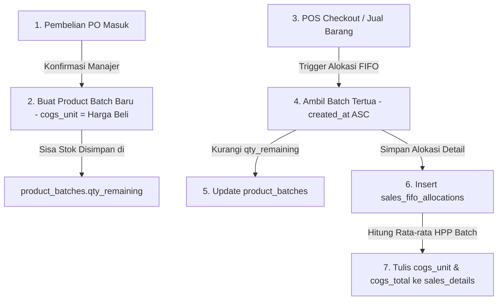

# Spesifikasi Arsitektur & Breakdown Detail Backoffice KGS

Dokumen ini mendefinisikan desain teknis, struktur database tambahan, dan alur modul manajerial untuk backend **KGS Backoffice Dashboard**.

---

## 1. Pemisahan Modul Berdasarkan Role (Role-Based Access Control)

Akses halaman di Next.js akan dibatasi menggunakan Middleware/Auth check dan RLS Supabase:

| Modul | Sub-Fitur | Cashier | Manager | Owner |
| :--- | :--- | :---: | :---: | :---: |
| **Stock Management** | Stok Barang, Transfer Stok, Konfirmasi PO | ❌ |  |  |
| **Product Master Data** | CRUD Produk, Harga Jual, Import Data | ❌ |  |  |
| **Finance Module** | Jurnal Ledger, P&L, Neraca, Approval CA | ❌ | ❌ |  |

---

## 2. Alur Desain FIFO (First-In, First-Out) untuk HPP

Untuk mengakomodasi fluktuasi harga pembelian, kita akan mengabaikan rata-rata (*Average*) dan menerapkan metode FIFO murni. Barang yang dibeli pertama kali akan dikeluarkan terlebih dahulu saat ada penjualan.

### A. Tambahan Tabel Database
Kita memerlukan dua tabel baru di Supabase:

```sql
-- Batch persediaan barang masuk (pembelian)
CREATE TABLE product_batches (
    id UUID PRIMARY KEY DEFAULT uuid_generate_v4(),
    product_id UUID NOT NULL REFERENCES products(id) ON DELETE CASCADE,
    warehouse_id UUID NOT NULL REFERENCES warehouses(id) ON DELETE CASCADE,
    qty_purchased NUMERIC NOT NULL,
    qty_remaining NUMERIC NOT NULL, -- Sisa stok di batch ini
    cogs_unit NUMERIC NOT NULL,     -- Harga beli per unit (HPP)
    created_at TIMESTAMPTZ NOT NULL DEFAULT NOW()
);

-- Catatan detail alokasi penjualan terhadap batch FIFO
CREATE TABLE sales_fifo_allocations (
    id UUID PRIMARY KEY DEFAULT uuid_generate_v4(),
    sales_detail_id UUID NOT NULL REFERENCES sales_details(id) ON DELETE CASCADE,
    product_batch_id UUID NOT NULL REFERENCES product_batches(id) ON DELETE CASCADE,
    qty_allocated NUMERIC NOT NULL,  -- Kuantitas yang diambil dari batch ini
    cogs_unit NUMERIC NOT NULL,      -- HPP batch saat dibeli
    created_at TIMESTAMPTZ NOT NULL DEFAULT NOW()
);
```

### B. Visualisasi Alur FIFO (Mermaid)



---

## 3. Modul Konfirmasi Order Stok (Stock Confirmation)

Modul ini memproses penambahan stok. Penambahan stok tidak langsung terjadi saat PO dibuat, melainkan harus dikonfirmasi oleh manajer setelah fisik barang sampai di gudang.

1. **Kasir / Staf mengajukan Order Stok (Draft Purchase Order)**.
2. **Manajer meninjau berkas PO masuk**.
3. **Manajer mengklik "Konfirmasi & Terima Barang"**:
   * Sistem merubah status `purchases_headers.payment_status` ke status yang sesuai.
   * Sistem menambah kuantitas di `product_stocks`.
   * Sistem membuat baris baru di `product_batches` (untuk log FIFO HPP) dengan harga beli saat itu.

---

## 4. Modul Import Master Data (CSV / Excel Import)

Untuk mempercepat inisiasi proyek, manajer memerlukan alat import data. 
* **Format File (CSV)**:
  ```csv
  sku,name,category,price,purchase_price,uom,initial_stock,warehouse_code
  PROD-001,Semen Padang 50kg,Bahan Bangunan,72000,65000,sak,100,GDS
  ```
* **Logika Backend**:
  1. Membaca baris CSV.
  2. Melakukan UPSERT ke tabel `products`.
  3. Memasukkan data stok awal ke `product_stocks` sesuai dengan `warehouse_code`.
  4. Membuat Batch Persediaan Awal di `product_batches` dengan `cogs_unit = purchase_price`.

---

## 5. Modul Penyesuaian Stok (Stock Adjustment) & Stock Opname

Untuk menangani selisih stok akibat barang rusak, susut, atau audit fisik periodik secara akurat:

### A. Tambahan Tabel Database
```sql
-- Status Opname
CREATE TYPE opname_status AS ENUM ('DRAFT', 'SUBMITTED', 'APPROVED');

-- Audit fisik stok opname
CREATE TABLE stock_opnames (
    id UUID PRIMARY KEY DEFAULT uuid_generate_v4(),
    opname_no TEXT UNIQUE NOT NULL, -- e.g. OPN-20260713-0001
    warehouse_id UUID NOT NULL REFERENCES warehouses(id) ON DELETE CASCADE,
    status opname_status NOT NULL DEFAULT 'DRAFT',
    notes TEXT,
    created_by UUID REFERENCES profiles(id),
    created_at TIMESTAMPTZ NOT NULL DEFAULT NOW()
);

-- Detail hitungan fisik stok opname per item
CREATE TABLE stock_opname_details (
    id UUID PRIMARY KEY DEFAULT uuid_generate_v4(),
    opname_id UUID NOT NULL REFERENCES stock_opnames(id) ON DELETE CASCADE,
    product_id UUID NOT NULL REFERENCES products(id) ON DELETE CASCADE,
    system_qty NUMERIC NOT NULL,   -- Stok tercatat di sistem
    physical_qty NUMERIC NOT NULL, -- Stok fisik yang dihitung
    difference NUMERIC NOT NULL,   -- Selisih (system_qty - physical_qty)
    notes TEXT
);

-- Penyesuaian stok manual (penyesuaian mandiri atau hasil dari opname)
CREATE TABLE stock_adjustments (
    id UUID PRIMARY KEY DEFAULT uuid_generate_v4(),
    adjustment_no TEXT UNIQUE NOT NULL, -- e.g. ADJ-20260713-0001
    product_id UUID NOT NULL REFERENCES products(id) ON DELETE CASCADE,
    warehouse_id UUID NOT NULL REFERENCES warehouses(id) ON DELETE CASCADE,
    opname_detail_id UUID REFERENCES stock_opname_details(id) ON DELETE SET NULL, -- Referensi jika dibuat dari opname
    qty_adjusted NUMERIC NOT NULL, -- Positif untuk penambahan, negatif untuk pengurangan
    cogs_unit NUMERIC NOT NULL,    -- Harga per unit saat disesuaikan (HPP)
    reason TEXT NOT NULL,          -- e.g. 'Rusak', 'Hilang', 'Selisih Opname'
    created_by UUID REFERENCES profiles(id),
    created_at TIMESTAMPTZ NOT NULL DEFAULT NOW()
);
```

### B. Hubungan dengan Metode FIFO
1. **Penyesuaian Positif (Stok Bertambah / Temuan)**:
   * Menambahkan stok di `product_stocks`.
   * Membuat batch persediaan baru di `product_batches` dengan `cogs_unit` setara dengan COGS produk saat itu.
2. **Penyesuaian Negatif (Stok Berkurang / Rusak / Hilang)**:
   * Mengurangi stok di `product_stocks`.
   * Mengurangi sisa stok (`qty_remaining`) dari batch FIFO tertua (`product_batches`), mirip dengan pemotongan transaksi penjualan.
   * Menulis event akuntansi `'EXPENSE_POSTED'` dengan nilai total kerugian HPP barang ke antrean `financial_events` dengan kategori `'Kerugian Selisih Persediaan'` agar otomatis terposting ke Buku Besar.

---

## 6. Rencana Tugas Implementasi (To-Do List)

### Langkah 6.1: Eksekusi SQL Migrasi Baru (Supabase)
* [ ] Jalankan query pembuatan tabel `product_batches` dan `sales_fifo_allocations`.
* [ ] Jalankan query pembuatan tipe `opname_status` dan tabel `stock_opnames`, `stock_opname_details`, serta `stock_adjustments`.
* [ ] Buat trigger/fungsi PostgreSQL `allocate_fifo_cogs()` untuk melakukan kalkulasi FIFO otomatis saat terjadi penjualan.
* [ ] Buat fungsi trigger/RPC `approve_stock_opname()` untuk mengesahkan opname fisik dan meluncurkan penyesuaian stok otomatis.

### Langkah 6.2: Pembuatan API & Komponen Impor di Backoffice
* [ ] Setup route `/api/products/import` untuk membaca data CSV/Excel produk.
* [ ] Buat UI Halaman CRUD Produk dan tombol Impor CSV.

### Langkah 6.3: Halaman Konfirmasi Order Stok
* [ ] Buat UI Manajemen Pembelian (PO) dengan filter "Menunggu Konfirmasi".
* [ ] Tautkan tombol "Konfirmasi Terima" ke RPC database yang menambah stok dan batch FIFO.

### Langkah 6.4: Laporan Laba/Rugi Murni FIFO
* [ ] Perbarui tab Laporan Keuangan agar menghitung HPP berdasarkan hasil alokasi tabel `sales_fifo_allocations` (bukan harga rata-rata/cogs statis).
