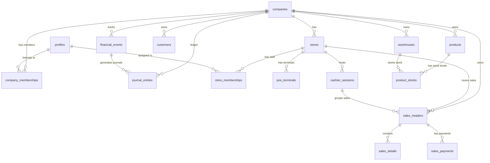

# Multi-Company Entity Relationship Diagram (ERD)

Rancangan ERD Multi-Company KGS menggunakan representasi diagram Mermaid.

---

## Penjelasan Relasi Utama:
1. **`companies`** adalah pusat tenant. Semua data bisnis (seperti produk, pelanggan, gudang) harus terikat ke satu ID perusahaan (`company_id`).
2. **`stores`** terikat ke perusahaan, memisahkan wilayah penjualan operasional.
3. **`company_memberships`** menghubungkan tabel global `profiles` (yang mereferensikan akun otentikasi Supabase `auth.users`) ke perusahaan tertentu dengan memegang `role_code` (Owner, Manager, Finance, dll).
4. **`store_memberships`** digunakan untuk membatasi kasir agar hanya dapat mengakses terminal POS di toko tempat mereka ditugaskan.
